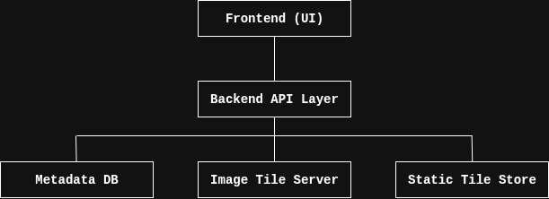
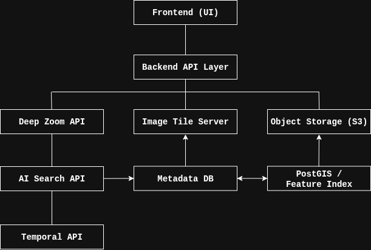

# Backend Architecture

This repository provides the backend implementation of the **NASA 2025 Solaria** platform, a tool for exploring massive planetary and space image datasets through zoomable interfaces and basic metadata search.

This `.md` file describes the **backend MVP (Minimum Viable Product)** that can be built with future-proofing considerations for advanced features like AI-powered search and temporal comparisons.

---

## Contents

- [Objective](#objective)
- [Features in 1-Day MVP](#features-in-1-day-mvp)
- [Tech Stack](#tech-stack)
- [Architecture (MVP)](#architecture-mvp)
- [Architecture (Future)](#architecture-future)
- [API Endpoints](#api-endpoints)
- [Tile Generation Process](#tile-generation-process)
- [Folder Structure](#folder-structure)
- [Getting Started](#getting-started)
- [Future Work](#future-work)

---

## Objective

Allow users to:

- View high-resolution planetary or space images using deep zoom
- Search images via simple metadata filters (e.g. name, mission, timestamp)
- Retrieve metadata for zoomable images
- Serve image tiles efficiently via standard tile URL format

---

## ✅ Features in 1-Day MVP

| Feature                          | Status                     |
|----------------------------------|----------------------------|
| FastAPI backend setup            | ✅ Ready                   |
| Ingest 1+ large images           | ✅ Manual                  |
| Generate Deep Zoom tiles         | ✅ Ready via `vips dzsave` |
| Serve tiles via REST endpoint    | ✅ Implemented             |
| SQLite/PostgreSQL metadata store | ✅ Basic schema            |
| Basic search (by name, mission)  | ✅ Supported               |
| Get image metadata               | ✅ Supported               |
| Compare basic architecture plans | ✅ Included below          |

---

## Tech Stack

| Component      | Tech Used               |
|----------------|-------------------------|
| API Framework  | FastAPI (Python)        |
| Web Server     | Uvicorn (ASGI)          |
| Image Tiling   | libvips (`vips dzsave`) |
| Database       | SQLite (or PostgreSQL)  |
| Storage        | Local filesystem        |
| Deployment     | Docker / Local host     |

---

## Architecture (MVP – 1 Day Scope)




---

## Architecture (Future – AI Search, Temporal, Overlays)



---

## API Endpoints

### `GET /api/images`

List available images (optionally filter by mission or name):

```http
GET /api/images?mission=MRO
```

#### Response:

```json
[
  {
    "id": "mars_2023_storm",
    "name": "Mars Dust Storm",
    "mission": "MRO",
    "timestamp": "2023-08-11",
    "tile_url": "/tiles/mars_2023_storm/{z}/{x}/{y}.jpg"
  }
]
```

### GET /api/image/{image_id}

Get metadata about a specific image.

```http
GET /api/image/mars_2023_storm
```

#### Response:

```json
{
  "id": "mars_2023_storm",
  "name": "Mars Dust Storm",
  "mission": "MRO",
  "timestamp": "2023-08-11",
  "description": "High-resolution view of dust storm on Mars.",
  "tile_url": "/tiles/mars_2023_storm/{z}/{x}/{y}.jpg"
}
```

### GET /tiles/{image_id}/{z}/{x}/{y}.jpg

Serves image tiles using the Deep Zoom format. Compatible with OpenSeadragon or any map-like tile viewer.

---

## Tile Generation Process

To prepare images:

1. Install vips:
```bash
sudo apt install libvips-tools
```

2. Generate Deep Zoom tiles:
```bash
vips dzsave andromeda.tif tiles/andromeda --suffix .jpg[Q=80]
```

3. Output structure:
```bash
tiles/
  andromeda/
    dzi/
    0/
    1/
    2/
    ...
```

4. In database, register:
- `image_id = "andromeda"`
- `tile_url = "/tiles/andromeda/{z}/{x}/{y}.jpg"`

---

## Folder Structure
```
/backend/
├── main.py                 # FastAPI app
├── db.py                   # DB schema and access
├── models.py               # Pydantic models
├── tiles/                  # Generated image tiles
│   └── mars_2023_storm/
│       └── 0/1/2/...       # Deep Zoom tiles
├── data/metadata.db        # SQLite DB
├── requirements.txt
└── README.md
```

---

## Future Work

After MVP is working, some desirable improvements are:
- AI-based image search (OpenAI CLIP + Faiss)
- Temporal image comparison (with timeline API)
- Spectral band overlays (NDVI, RGB/NIR)
- PostGIS for spatial search
- Docker + cloud deployment
- Authentication and rate limits

---

## Example Dataset Ideas
- Andromeda 2.5 gigapixel (Hubble)
- Mars Dust Storm (MRO)
- Moon Craters (LRO)
- Earth NDVI maps (Landsat)